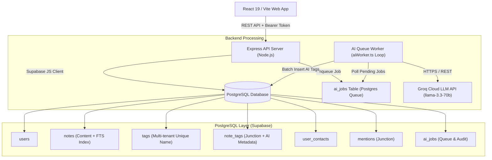

# 🧠 Mindshare — Intelligent Notes & Knowledge Management System

Mindshare is a high-performance, full-stack notes and thoughts management platform designed for scale (**10,000+ notes**). It features real-time hashtag parsing, contact `@mentions`, sub-10ms PostgreSQL full-text search, and persistent asynchronous AI auto-tagging via Groq Cloud (`llama-3.3-70b-versatile`).

---

## ⚡ Key Architectural Features

- **🚀 Built for 10,000+ Notes Scale:** REST API with server-side SQL pagination (`limit`/`offset`), streaming responses, and low memory consumption (< 12 MB RAM footprint).
- **🔍 Sub-10ms Full-Text Search (FTS):** Powered by PostgreSQL generated `tsvector` column (`fts`) and a high-performance GIN index (`idx_notes_fts`).
- **🏷️ Smart Tagging & Mention System:** Instant client-side & server-side regex parser for `#hashtags` and `@people` with contact directory validation.
- **🤖 Persistent Async AI Queue (`ai_jobs`):** Decoupled background worker (`aiWorker.ts`) polling Groq LLM for auto-tagging with exponential backoff retries, state persistence (`pending`, `processing`, `completed`, `failed`), and error tracking.
- **🔒 Multi-Tenant Data Isolation:** Scoped tag candidate keys `(user_id, LOWER(name))` and atomic multi-step writes via `create_note_with_relations` PL/pgSQL stored procedure.
- **🎨 Glassmorphism Responsive UI:** Dynamic feed timeline, active filter chips, slide-over detail panel, single-user password authentication, and toast notifications.

---

## 🏗️ High-Level System Architecture



---

## 🛠️ Technology Stack

### Frontend
- **Framework:** React 19, TypeScript, Vite
- **Styling:** TailwindCSS v4, Glassmorphism design tokens
- **Icons & UI:** Lucide React

### Backend
- **Server:** Node.js, Express, TypeScript (`tsx`)
- **Database Client:** `@supabase/supabase-js`
- **AI Service:** Groq Cloud API (`llama-3.3-70b-versatile`)
- **Queue Worker:** In-process non-blocking task processor (`aiWorker.ts`)

### Database (PostgreSQL / Supabase)
- **Search:** PostgreSQL GIN full-text search (`to_tsvector`)
- **Indexes:** Composite B-Tree indexes for user timelines and junction lookups
- **Transactions:** Custom PL/pgSQL function (`create_note_with_relations`)

---

## 🚀 Quick Start Guide

### Prerequisites
- Node.js (v18+ recommended)
- A free **Supabase** database project
- A free **Groq Cloud API** key

### 1. Clone & Install Dependencies

```bash
git clone https://github.com/DevanshBamrara/mindshare.git
cd mindshare

# Install frontend dependencies
npm install

# Install backend dependencies
cd server
npm install
cd ..
```

### 2. Environment Setup

Create a `.env.local` file in the root directory:

```env
# Server Port & Auth
PORT=3001
APP_PASSWORD=your_secure_password_here

# Supabase Credentials
SUPABASE_URL=https://your-project.supabase.co
SUPABASE_ANON_KEY=your_supabase_anon_key

# Groq LLM API Key
GROQ_API_KEY=gsk_your_groq_api_key
```

### 3. Database Migration

1. Open your **Supabase Dashboard** $\rightarrow$ **SQL Editor**.
2. Copy the entire contents of [`database/schema.sql`](file:///c:/Users/Dev/Documents/Mindshare/database/schema.sql).
3. Paste into SQL Editor and click **Run**.

### 4. Run Development Servers

```bash
# Terminal 1: Run Frontend
npm run dev

# Terminal 2: Run Backend API & AI Queue Worker
npm run dev --prefix server
```

- **Frontend App:** `http://localhost:5173`
- **Backend API:** `http://localhost:3001`

---

## 📡 API Endpoints Reference

| Method | Endpoint | Description | Query / Body Params |
| :--- | :--- | :--- | :--- |
| `GET` | `/health` | Server Health Status | None |
| `POST` | `/api/auth/login` | Session Authentication | `{ "password": "..." }` |
| `GET` | `/api/notes` | Scalable Paginated Notes | `limit=50&offset=0&tag=foo&mention=bar&q=search` |
| `POST` | `/api/notes` | Create Note & Queue AI | `{ "content": "Thought #tag @contact" }` |
| `PUT` | `/api/notes/:id` | Update Note & Resync | `{ "content": "Updated content" }` |
| `DELETE` | `/api/notes/:id` | Delete Note | None |
| `GET` | `/api/contacts` | Get People Directory | None |
| `POST` | `/api/contacts` | Add New Contact | `{ "displayName": "Alex", "email": "alex@co.com" }` |

---

## 📖 Deployment Guide

For full production deployment instructions (Vercel + Render / Koyeb + Supabase), see the **[Full Deployment Guide](DEPLOYMENT.md)**.

---

## 📄 License

MIT License. Developed for intelligent notes and team thought management.
